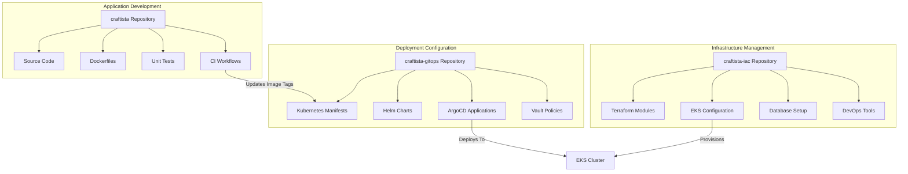
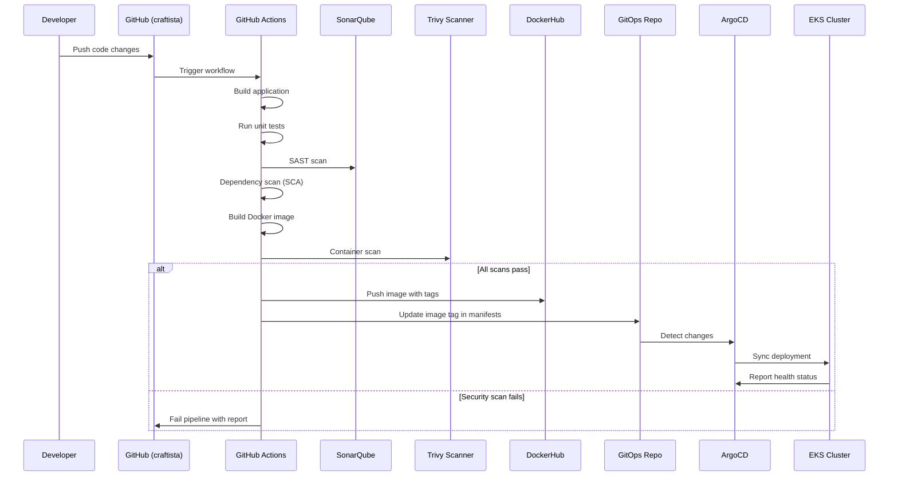
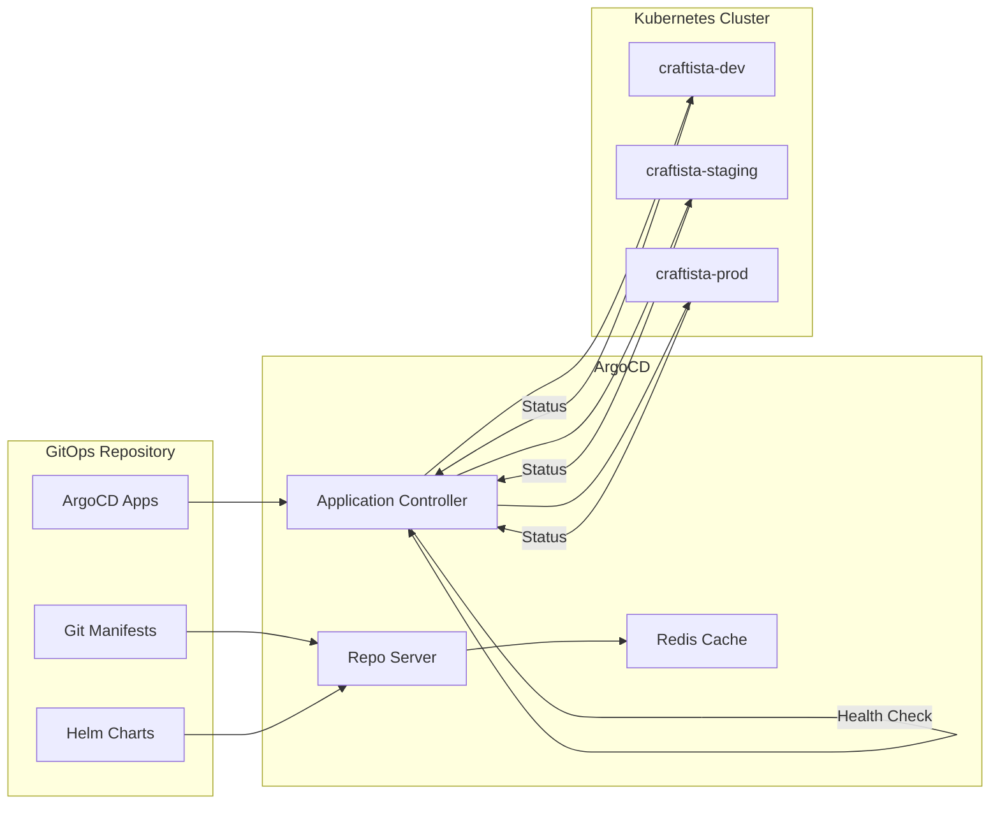
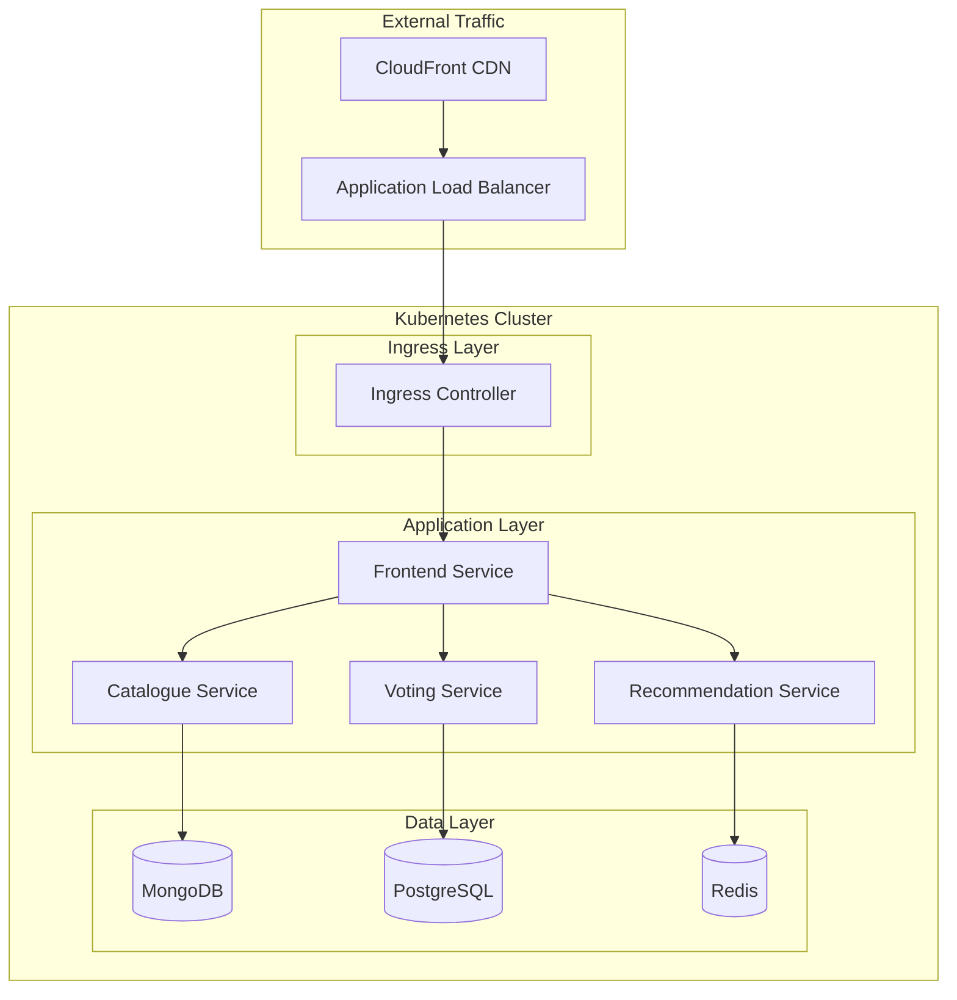
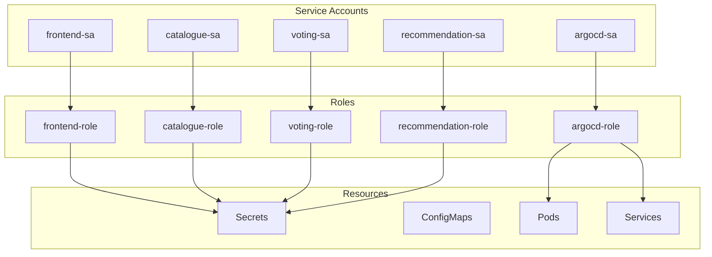
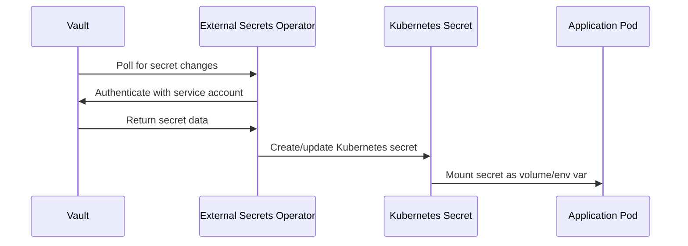
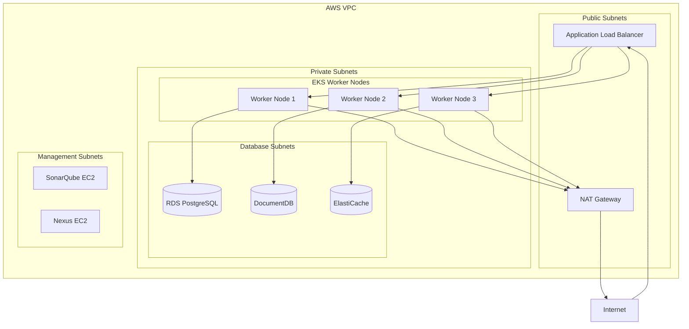
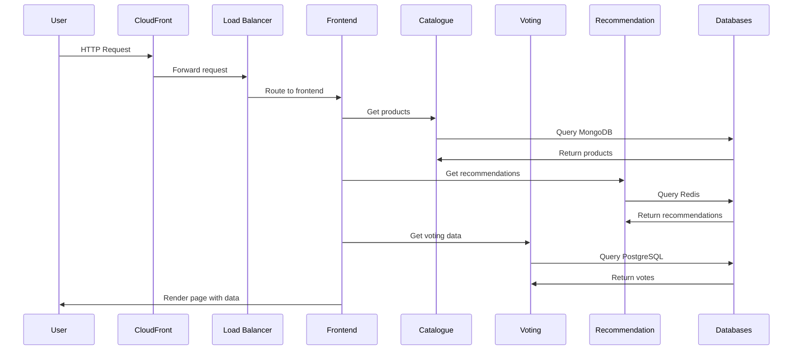
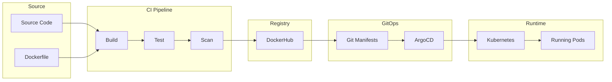

# Craftista GitOps Architecture

This document provides a comprehensive overview of the Craftista GitOps architecture, detailing the three-repository structure, CI/CD pipeline flow, and component interactions.

## Table of Contents

- [Overview](#overview)
- [Three-Repository Architecture](#three-repository-architecture)
- [CI/CD Pipeline Flow](#cicd-pipeline-flow)
- [GitOps Sync Process](#gitops-sync-process)
- [Component Interactions](#component-interactions)
- [Security Architecture](#security-architecture)
- [Network Architecture](#network-architecture)
- [Data Flow](#data-flow)

## Overview

The Craftista application implements a modern GitOps architecture that separates concerns across three distinct repositories, each serving a specific purpose in the software delivery lifecycle. This architecture ensures scalability, security, and maintainability while following DevSecOps best practices.

### Key Architectural Principles

1. **Separation of Concerns**: Application code, infrastructure, and deployment configurations are managed separately
2. **GitOps Methodology**: Git serves as the single source of truth for all configurations
3. **Security by Design**: Secrets management, network policies, and RBAC are built into the architecture
4. **Environment Parity**: Consistent deployment patterns across dev, staging, and production
5. **Automation First**: Minimal manual intervention in the deployment process

## Three-Repository Architecture

### Repository Responsibilities



### 1. craftista Repository (Application Code)

**Purpose**: Contains all application source code and CI/CD workflows

**Contents**:

- **Microservices Source Code**:
  - `frontend/` - Node.js/Express application
  - `catalogue/` - Python/Flask API service
  - `voting/` - Java/Spring Boot service
  - `recommendation/` - Go service
- **Build Configurations**:
  - Dockerfiles for each service
  - Package management files (package.json, requirements.txt, pom.xml, go.mod)
- **Testing**:
  - Unit tests for each service
  - Integration test suites
- **CI/CD Workflows**:
  - GitHub Actions workflows for each service
  - Security scanning configurations
  - Image build and push automation

**Key Responsibilities**:

- Source code version control
- Automated testing execution
- Security scanning (SAST, SCA, container scanning)
- Docker image building and publishing
- GitOps repository updates with new image tags

### 2. craftista-iac Repository (Infrastructure as Code)

**Purpose**: Manages all AWS infrastructure using Terraform

**Contents**:

- **Core Infrastructure**:
  - VPC and networking components
  - EKS cluster configuration
  - Security groups and IAM roles
- **Database Infrastructure**:
  - RDS PostgreSQL for voting service
  - DocumentDB MongoDB for catalogue service
  - ElastiCache Redis for recommendation service
- **DevOps Tools**:
  - SonarQube EC2 instance
  - Nexus Repository EC2 instance
  - Application Load Balancers
- **Environment Configurations**:
  - Separate configurations for dev, staging, prod
  - Environment-specific sizing and settings

**Key Responsibilities**:

- Infrastructure provisioning and management
- Environment isolation and configuration
- Security group and network policy management
- Database and storage provisioning
- DevOps tooling infrastructure

### 3. craftista-gitops Repository (Deployment Configuration)

**Purpose**: Contains all Kubernetes deployment configurations and GitOps workflows

**Contents**:

- **Kubernetes Manifests**:
  - Base configurations using Kustomize
  - Environment-specific overlays
  - Network policies and RBAC configurations
- **Helm Charts**:
  - Templated application deployments
  - Environment-specific value files
  - Dependency management
- **ArgoCD Configurations**:
  - Application definitions
  - Project configurations
  - Sync policies and health checks
- **Security Configurations**:
  - Vault policies and secret templates
  - External Secrets Operator configurations
  - Service account and RBAC definitions

**Key Responsibilities**:

- Deployment configuration management
- Environment-specific customizations
- Secrets management integration
- GitOps workflow orchestration
- Operational documentation and runbooks

## CI/CD Pipeline Flow



### Pipeline Stages

1. **Code Commit**: Developer pushes changes to feature branch
2. **Build Stage**:
   - Checkout source code
   - Install dependencies
   - Compile/build application
3. **Test Stage**:
   - Execute unit tests
   - Run integration tests
   - Generate test coverage reports
4. **Security Stage**:
   - SAST analysis with SonarQube
   - Dependency vulnerability scanning
   - License compliance checking
5. **Image Stage**:
   - Build Docker image
   - Scan image with Trivy
   - Tag with commit SHA and branch name
6. **Publish Stage**:
   - Push image to DockerHub registry
   - Update GitOps repository with new image tag
7. **Deploy Stage**:
   - ArgoCD detects GitOps changes
   - Syncs new configuration to cluster
   - Monitors deployment health

## GitOps Sync Process



### Sync Policies by Environment

| Environment | Sync Policy | Prune | Self-Heal | Manual Approval |
| ----------- | ----------- | ----- | --------- | --------------- |
| Development | Automatic   | ✅    | ✅        | ❌              |
| Staging     | Automatic   | ✅    | ✅        | ❌              |
| Production  | Manual      | ✅    | ❌        | ✅              |

### ArgoCD Application Structure

Each microservice has dedicated ArgoCD Applications per environment:

```yaml
# Example: Frontend Development Application
apiVersion: argoproj.io/v1alpha1
kind: Application
metadata:
  name: craftista-frontend-dev
  namespace: argocd
spec:
  project: craftista-dev
  source:
    repoURL: https://github.com/charliepoker/craftista-gitops.git
    targetRevision: main
    path: kubernetes/overlays/dev/frontend
  destination:
    server: https://kubernetes.default.svc
    namespace: craftista-dev
  syncPolicy:
    automated:
      prune: true
      selfHeal: true
```

## Component Interactions

### Service Communication



### Network Policies

Network policies enforce micro-segmentation:

- **Default Deny**: All pod-to-pod communication blocked by default
- **Frontend Policy**: Can communicate with all backend services
- **Catalogue Policy**: Can only communicate with MongoDB and receive from frontend/voting
- **Voting Policy**: Can communicate with PostgreSQL and catalogue, receive from frontend
- **Recommendation Policy**: Can only communicate with Redis and receive from frontend

### RBAC Structure



## Security Architecture

### Secrets Management Flow



### Vault Secret Hierarchy

```
secret/
├── craftista/
│   ├── dev/
│   │   ├── frontend/
│   │   │   ├── session-secret
│   │   │   └── api-keys
│   │   ├── catalogue/
│   │   │   ├── mongodb-uri
│   │   │   └── mongodb-credentials
│   │   ├── voting/
│   │   │   ├── postgres-uri
│   │   │   └── postgres-credentials
│   │   └── recommendation/
│   │       ├── redis-uri
│   │       └── redis-password
│   ├── staging/ (same structure)
│   └── prod/ (same structure)
├── github-actions/
│   ├── dockerhub-credentials
│   ├── sonarqube-token
│   └── gitops-deploy-key
└── argocd/
    ├── admin-password
    └── github-webhook-secret
```

## Network Architecture

### EKS Cluster Network Design



### Security Groups

| Component        | Inbound Rules                    | Outbound Rules                              |
| ---------------- | -------------------------------- | ------------------------------------------- |
| EKS Worker Nodes | ALB (80,443), Node-to-Node (All) | Internet (443), Databases (5432,27017,6379) |
| RDS PostgreSQL   | EKS Nodes (5432)                 | None                                        |
| DocumentDB       | EKS Nodes (27017)                | None                                        |
| ElastiCache      | EKS Nodes (6379)                 | None                                        |
| SonarQube        | GitHub Actions (9000)            | Internet (443)                              |
| Nexus            | GitHub Actions (8081)            | Internet (443)                              |

## Data Flow

### Application Request Flow



### Deployment Data Flow



This architecture ensures:

- **Scalability**: Horizontal pod autoscaling and multi-AZ deployment
- **Security**: Defense in depth with multiple security layers
- **Reliability**: Health checks, self-healing, and automated rollbacks
- **Observability**: Comprehensive logging, metrics, and tracing
- **Maintainability**: Clear separation of concerns and automated operations
